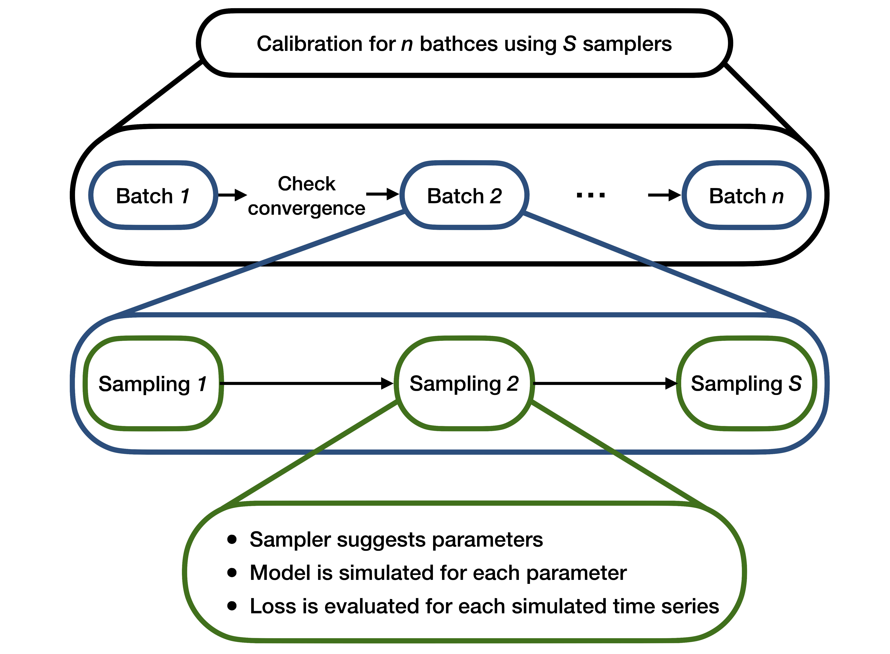

<figure>

    

    <figcaption>Illustration of Black-it calibration. The calibration (black lines) is divided in a maximum of <em>n</em> batches (blue lines), and in each batch <em>S</em> samplers are sequentially deployed (green lines).
Each sampler suggests a set of parameters, for which the model is simulated and the loss function is evaluated.</figcaption>
</figure>

# How it works

The calibrator is essentially an optimizer which works on simulated data, produced by a specified model, 
and searches the parametric space by chaining a set of chosen algorithms. 
For a complete example about this, check the [Examples](examples.md) section.

The calibrator works iteratively and each iteration consists of three steps:

1. Search algorithms are employed sequentially to sample a set of parameters. In this sense, the parameter space is "searched"
2. Data is simulated $E$ times for each sampled parameter set. We will refer to $E$ as `ensemble_size`
3. A loss function is evaluated, measuring the distance between the simulated data and the real data

This is repeated until the loss function is very close to 0 or the maximum number of iterations is reached. 
The process is illustrated in the above figure. 

*Remark*: the simulator is a distinct subsystem in this process. It can be as simple as a Python function or it can be an external simulator altogether. The calibrator simply *runs* it each time.

## Simulation

The basic premise behind the calibrator is that it uses simulated data. That is why it adapts well to [agent-based models](https://en.wikipedia.org/wiki/Agent-based_model). Simulated data is produced in each iteration according to a given model, using the sampled parameters.

A model can be any function which produces data and which depends on one or more parameters. This can be a probability distribution (like the standard Gaussian) or a stochastic process (like an [ARMA model](https://en.wikipedia.org/wiki/Autoregressive%E2%80%93moving-average_model) or a [Markov chain](https://en.wikipedia.org/wiki/Markov_chain)). Some examples of these "standard" models are the ones found in **`examples/models/simple_models.py`**. The `examples/models` directory also contains other models, including agent-based ones used in epidemiology and economics. For a description of them, check the [Examples](examples.md) section.

*Remark*: if you need to implement your own model, check [how to use](index.md#model) and the [simulator interface](simulator_interface.md).
## Optimization

After the model is defined, the simulated datasets must be compared against the real dataset. The natural choice of distance for this is the mean distance between a simulated dataset and the real dataset, i.e., for each parameter $\theta$, we have:
$$ \delta(\theta) = \frac{1}{E} \sum_{e=1}^E L\Big(\mathbf{x}, \mathbf{x}_e(\theta)\Big)$$
where:

- $\{\mathbf{x}_e\}_{e=1}^E$ are the $E$ simulated datasets which depend upon the parameter $\theta$
- $\mathbf{x}$ is the real dataset
- $L$ is the chosen loss function

The loss function $L$ can be anything that suits the problem which is being studied. Already implemented loss functions are:

- `MinkowskiLoss`, a generalization of the Euclidean distance (see [Minkowski distance](https://en.wikipedia.org/wiki/Minkowski_distance))
- `MethodOfMomentsLoss`, the squared difference between real and simulated moments, based on [method of simulated moments](https://en.wikipedia.org/wiki/Method_of_simulated_moments)
- `GslDivLoss`, which is the GLS-div information criterion introduced by Lamperti (2018) in [An information theoretic criterion for empirical validation of simulation models](https://scholar.google.it/citations?view_op=view_citation&hl=it&user=zl7Vpq0AAAAJ&citation_for_view=zl7Vpq0AAAAJ:UebtZRa9Y70C).
- `FourierLoss`, an Euclidean loss computed in the frequency domain.

In principle one should minimize the function $\delta$ over all possible values of $\theta$. This is not possible in practice of course and that is why a set of search algorithm is used to sample parameters and get as low a distance $\delta$ as we can get.

The sampling procedure depends on the chosen algorithm(s). The implemented algorithms can be divided in two groups, depending on how they act:

- `RandomUniformSampler`, `HaltonSampler` and `RSequenceSampler` sample at each iteration independently from previous iterations. This is because they aim at sampling uniformly over the space. In particular, the first one is a simple uniform distribution, while the latter two try to fill the parameter space as uniformly as possible (check [low-discrepancy sequences](https://en.wikipedia.org/wiki/Equidistributed_sequence#Discrepancy)). For this reason, they are suggested to be used as a starting point to be concatenated with other algorithms. For more information on Halton sequences and R sequence, check [here](https://en.wikipedia.org/wiki/Halton_sequence) and [here](http://extremelearning.com.au/unreasonable-effectiveness-of-quasirandom-sequences/).
- `BestBatchSampler`, `GaussianProcessSampler`, `XGBoostSampler`, `RandomForestSampler`, and `ParticleSwarmSampler` sample using information from previous iterations (i.e. previously calculated distance functions). The first one samples new parameters around parameters with the lowest distance functions, the second, third and fourth one use respectively a Gaussian process, a random forest or an XGBoost classifier to predict the parameters with the lowest distance and sample those, the fifth implements a [particle swarm optimization](https://en.wikipedia.org/wiki/Particle_swarm_optimization). The use of such algorithms may help against computationally intensive calibrations, which can happen when dealing, for example, with agent-based models.

In this [notebook](overview_of_the_different_samplers.ipynb) you can find an overview of the different samplers.
