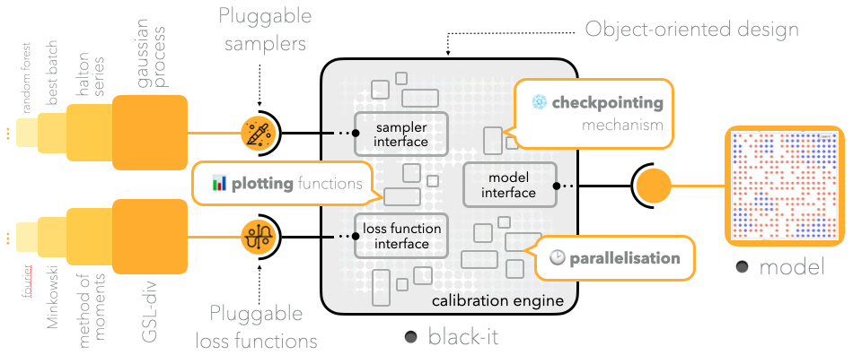

\vspace{0.2cm}
\begin{minipage}{.4\textwidth}
\begin{figure}
    \includegraphics[width=\textwidth]{figures/logo_1024.png}
\caption*{\emph{Black}-\textbf{it} logo.}
\end{figure}
\end{minipage}

# Summary

We present _Black_-**it**, a software package that aims to collect and popularise recent
  developments in the field of agent-based model calibration, and to provide an extensible testbed for future
  experimentation. 
We showcase its capabilities by benchmarking different calibration methods on standard
  calibration tasks, and find that mixing calibration strategies often improves performance.


# Statement of need

Agent-based models (ABMs) are an increasingly common technique for describing and understanding emergent phenomena 
  in complex social and economic systems [@miller2008complex; @richiardi2012agent; @turrell2016agent; @gatti2018agent].

Over the past decades, ABMs evolved from very simple models involving a few hundred agents moving on two-dimensional 
  grids [@schelling1971dynamic] to large-scale realistic simulations with tens of thousands of heterogeneous agents.
  Notable applications range from modelling the housing market [@baptista2016macroprudential; @catapano2021macroprudential] 
  to understanding the spreading of COVID-19 [@hinch2021openabm].

In order to profit from ABMs, it is necessary to _calibrate_ them, i.e., to find values for the set of parameters in
  the model that make it best fit real-world evidence and historical data available for the target phenomenon.

Unfortunately, the increasing scale and complexity of current models makes their calibration a significant 
  challenge [@platt2020comparison], as any non-trivial model has dozens of continuous and discrete parameters, which 
  generate an enormous search space. Its effective exploration by brute-force or trial-and-error 
  approaches [@tisue2004netlogo] is impractical.

The vastness of the parameter space of state-of-the-art ABMs calls for sophisticated search and calibration strategies.
Research in this direction has evolved significantly in recent years, and many competing calibration techniques 
  have been proposed [@ward2016dynamic; @grazzini2017bayesian; @lamperti2018agent; @platt2021bayesian; @farmer2022black].
However, they have been tested only in specific scenarios and remain out of reach for most researchers interested in ABM \emph{applications}.

In this work we address such shortcoming by introducing _Black_-**it**[^1], a calibration kit specifically designed for ABMs.
Our goal is to help ABM researchers from different disciplines to conveniently calibrate their models by gathering, 
  within a powerful and easy-to-use tool, several recent advances in the field.
The software is designed to be easy to extend, so it doubles as a research testbed for experimenting with 
  new or improved ideas.

[^1]:  _Black_-**it** is an acronym for **Bl**ack-box **A**BM **c**alibration **kit** (by the Bank of **It**aly).

_Black_-**it** differs from standard optimisation packages available in the Python ecosystem, such as
  SciPy [@virtanen2020scipy], in three main aspects.
First, _Black_-**it** not only allows the use of a set of advanced optimisation algorithms, but also provides a 
  general framework where new calibration schemes can easily be implemented and released to the ABM community.
Second, optimisation algorithms in _Black_-**it** are specifically designed for ABMs, i.e., for non-convex, 
  highly nonlinear and often discontinuous functions with no computable gradients, and cannot be found elsewhere
  collected in a single software.
Third, _Black_-**it** includes a rich set of features that make its use particularly convenient for ABM researchers, 
  such as a set of standard loss functions, parallelisation and checkpointing, plotting functionalities, and more.

The defining features of our tool will be reviewed in the next sections, where we also showcase its ease of use and 
  capabilities by benchmarking a set of complex calibration methods on some standard calibration tasks, using just a few
  lines of code[^2].

[^2]: Visit [https://github.com/bancaditalia/black-it/blob/main/examples/benchmarking_samplers.ipynb](https://github.com/bancaditalia/black-it/blob/main/examples/benchmarking_samplers.ipynb) for an example script.


# Software description

::: {exclude-in="jats"}

\begin{figure}[!htb]
    \centering
    \begin{minipage}{.56\textwidth}
        \centering
        \includegraphics[width=\textwidth]{figures/software_illustration.png}
        \caption{Illustration of the main features of \textit{Black}-\textbf{it}.}
        \label{fig:features}
    \end{minipage}%
    \hfill
    \begin{minipage}{0.43\textwidth}
        \centering
        \includegraphics[width=0.9\textwidth]{figures/code_snippet.png}
        \caption{A simple \textit{Black}-\textbf{it} calibration script.}
        \label{fig:script}
    \end{minipage}
\end{figure}

:::

```{=jats}
<fig id="figU003Afeatures">
  <caption><p>A simple <italic>Black</italic>-<bold>it</bold>
  calibration script.</p></caption>
  <graphic mimetype="image" mime-subtype="png" xlink:href="media/figures/software_illustration.png" xlink:title="" />
</fig>
<fig id="figU003Ascript">
  <caption><p>A simple <italic>Black</italic>-<bold>it</bold>
  calibration script.</p></caption>
  <graphic mimetype="image" mime-subtype="png" xlink:href="media/figures/code_snippet.png" xlink:title="" />
</fig>
```

<!-- { width=60% } -->

At a high level, _Black_-**it** calibration works as follows.

First, a _sampling method_ (or _sampler_) is summoned to suggest a set of promising parameter configurations to explore.
Second, the model to be calibrated is simulated for all the selected parameters.
Third, a specific _loss function_, measuring the "fitness" of the simulations with respect to the real data, is evaluated.
These three steps are performed in a loop, and this allows the samplers to progress towards better parameter values by 
exploiting the knowledge of previously computed loss functions.
The calibration loop ends when a certain target loss is achieved, or when a maximum number of epochs is reached.

_Black_-**it** implements a number of state-of-the-art samplers, including low-discrepancy sampling 
  series [@knysh2016blackbox] as well as adaptive samplers exploiting machine learning 
  surrogates [@lamperti2018agent] or genetic algorithms [@stonedahl2011genetic].
Moreover, our tool enables the construction of hybrid samplers by combining together multiple base samplers, 
  a strategy that often improves performance, as we show in the next section.
In addition, our tool implements a number of standard loss functions, such as the "method of moments" 
  distance [@franke2009applying] and the GSL-divergence [@lamperti2018information].
Currently, only likelihood-free losses are implemented, since probabilistic methods are typically too expensive 
  to be used in large-scale ABMs [@platt2020comparison], but nothing hinders the inclusion of the latest advancements
  in the field [@platt2021bayesian; @farmer2022black] into our tool.

 _Black_-**it** provides a range of "convenience" features, such as (i) efficient on-demand parallelisation, 
  (ii) a checkpointing mechanism to robustly persist the calibration state, and (iii) plotting functions to 
  visualise ongoing and completed calibrations. 

The toolkit is written in Python and it has a modular and object-oriented design, features that make it seamless 
  to implement custom sampling methods and loss functions, if needed.
\autoref{fig:features} provides a visual summary of the main features of the package, while \autoref{fig:script} shows a basic calibration script.

# Benchmarking of sampling methods

\vspace{-0.2cm}

\begin{figure}[!htb]
    \centering
    \includegraphics[width=0.78\textwidth]{figures/results_4.png}
    \caption{Loss as a function of the number of model evaluations for 3 models and 7 types of sampling strategies.}
    \label{fig:results}
\end{figure}

We showcase the capabilities of _Black_-**it** by benchmarking the performance of a set of sampling methods on the 
  calibration of three standard models.

## Models

We consider the following models:
  (i) A random walk model ('RW') with a structural break [@platt2020comparison] (5 free parameters),
  (ii) a SIR model on a Watts-Strogatz network [@simoes2008stochastic; @watts1998collective] (5 free parameters) 
  (iii) the standard Brock and Hommes model for asset pricing with 4 belief types ('BH4') [@brock1998heterogeneous] (8 free parameters).

For (i) and (iii) we use a method of moment distance loss, while for (ii) we use an Euclidean distance loss.
The target ('real') time series for the calibration were obtained by simulating the models with reasonable parameter choices.

## Sampling methods

We consider two types of samplers: random and adaptive.
Adaptive samplers propose parameters on the basis of previously computed loss values, while random samplers do
  not use that information and propose parameters in a purely random fashion.

As adaptive samplers ($A$) we consider a random-forest surrogate of the loss 
  function ($A_{rf}$) [@lamperti2018agent; @bajer2015benchmarking], and a genetic-type 
  algorithm [@stonedahl2011genetic] that samples small perturbations around the current optimal parameters ($A_{p}$).

## Experimental procedure

For each model, and fixing the number of model calls to $2400$ ($100$ epochs with a batch size of $24$), we perform 
  calibration runs for the 5 samplers described, as well as for all 80 possible combinations of 2 or 3 samplers together. 
We average all results over 15 repetitions.

## Results

In \autoref{fig:results} we report the minimal loss as a function of the number of calls for the 3 models, 
  aggregated for different groups of sampling strategies.
Not surprisingly, the non-adaptive (purely random) samplers $R$ generally demonstrate a very low performance (blue curve).
Similarly, the small perturbation sampler $A_{p}$ is also seen to underperform (green line) but, interestingly, 
  the performance of both $R$ and $A_p$ improves significantly as the two approaches are combined into a mixed strategy 
  $R+A_{p}$ (purple curve), striking a more balanced \emph{exploration-exploitation} trade-off.
Differently from $A_{p}$, the random forest sampler $A_{rf}$ performs very well on its own (orange curve), 
  while its performance is deteriorated by the addition of random samplers (red curve).
However, the performance of $A_{rf}$ is surpassed by the mixed strategy $A_{p} + A_{rf}$ (brown curve), 
  especially in late calibration epochs.
The 3-sampler combination $R + A_{p} + A_{rf}$ provides generally competitive results, as confirmed by 
  \autoref{tab:results}, which reports the best strategies for each model.

\begin{table}
\centering
\small
\begin{tabular}{|c|c|c|}
    \hline 
    RW & SIR & BH4 \tabularnewline
    \hline 
    \hline
    $A_{p}$ + $A_{rf}$ & $A_{p}$ + $A_{rf}$ & $A_{p}$ + $A_{rf}$\tabularnewline
    \hline
    $A_{rf}$  & $A_{rf}$ &  $R_{h}$ + $A_{p}$ + $A_{rf}$\tabularnewline
    \hline
    $R_{u}$ + $A_{p}$ + $A_{rf}$ & $R_{h}$  + $A_{p}$ + $A_{rf}$ & $R_{u}$ + $A_{p}$ + $A_{rf}$ \tabularnewline
    \hline
\end{tabular}
\caption{Top 3 sampling strategies for each model considered.}
\label{tab:results}
\end{table}

# Acknowledgements

The authors thank Andrea Gentili (Banca d'Italia) for the design of \autoref{fig:features} and of all _Black_-**it**
  schematics, and Sara Corbo (Banca d'Italia) for the design of the _Black_-**it** logo.

# References
